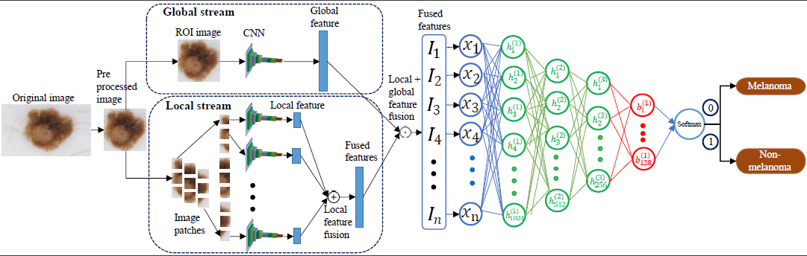
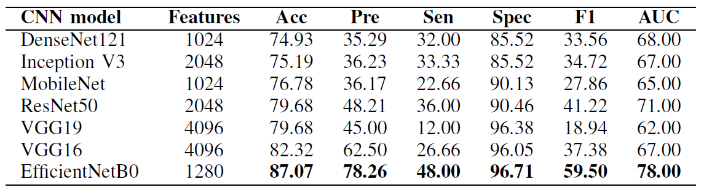

# Fusion_of_Local_Global_Feature_Representation
Proposes an ensemble feature fusion and sparse autoencoder (SAE) based framework.

Abstract: 

Automated skin cancer diagnosis is challenging due to inter-class uniformity, intra-class variation, and the complex structure of dermoscopy images. Convolutional neural networks (CNN) have recently made considerable progress in melanoma classification, even in the presence of limited skin images. One of the drawbacks of these methods is the loss of image details caused by downsampling high-resolution
skin images to a low resolution. Further, most approaches extract features only from the whole skin image. This work proposes an ensemble feature fusion and sparse autoencoder (SAE) based framework to overcome the above issues and improve melanoma classification performance. The proposed method extracts features from two streams, local and global, using a pre-trained CNN model. The local stream extracts
features from image patches, while the global stream derives features from the whole skin image, preserving both local and global representation. The features are then fused, and an SAE framework is subsequently designed to enrich the feature representation further. The proposed method is validated on ISIC 2016 dataset and the experimental results indicate the superiority of the proposed approach.

Proposed Methodology:

Our proposed method captures more detailed features from both small patches and whole skin images and fuses them using a decision level fusion approach. Further, an SAE network is used to provide enriched and low-dimensional features for melanoma classification. Figure
depicts the detailed architecture of the proposed method.

Results:

The investigation aims to compare the effectiveness of different contemporary CNN models pre-trained over the ImageNet dataset. It is worth mentioning here that the features have been derived from the global average pooling (GAP) layer for all architectures except VGG, where features have been derived from the fully connected (FC) layer. Table indicates derived feature vector size and the results obtained by different CNN architectures.

This work is publidhed in 44th IEEE international Conference of the Engineering in Medicine and Biology Society (EMBC), Glasgow, UK, 2022. For more reading you can follow this link: https://ieeexplore.ieee.org/document/9871370/.
